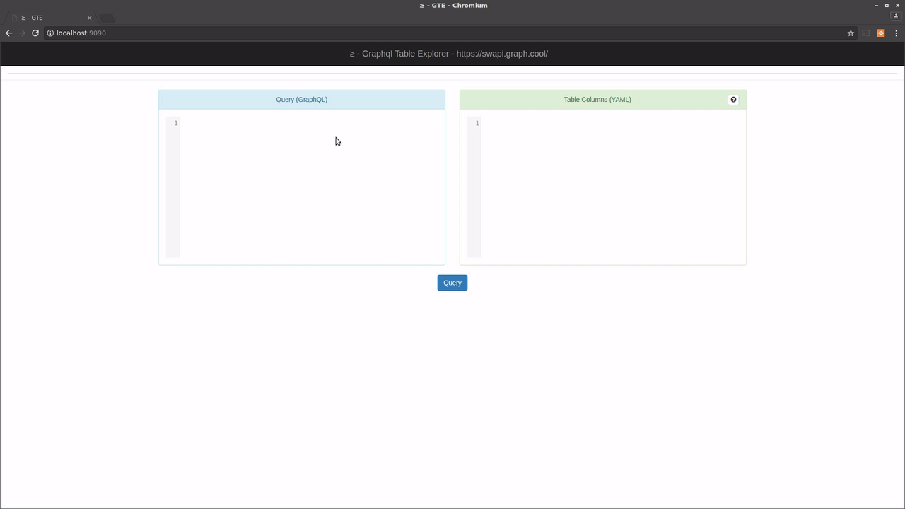
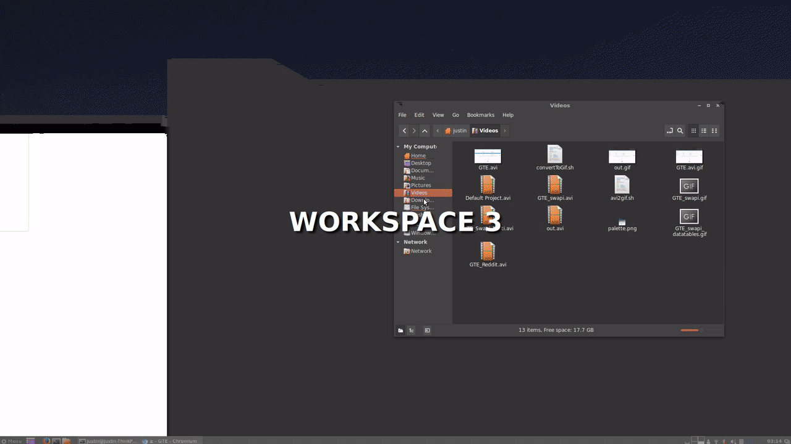

# GTE

## ≥ - GTE - **G**raphQL **T**able **E**xplorer

Step up your GraphQL game!   
Interactively query GraphQL endpoints with a simple table allowing to filter and analyze data, and perform advanced queries. 

Takes the base of [GraphiQL](https://github.com/graphql/graphiql) and makes it even better. 
* See the results in a beautiful tabular layout. 
* Filter and sort results in the table
* Point GTE to any GraphQL endpoint 
* Use output from a query as input to the next query. 